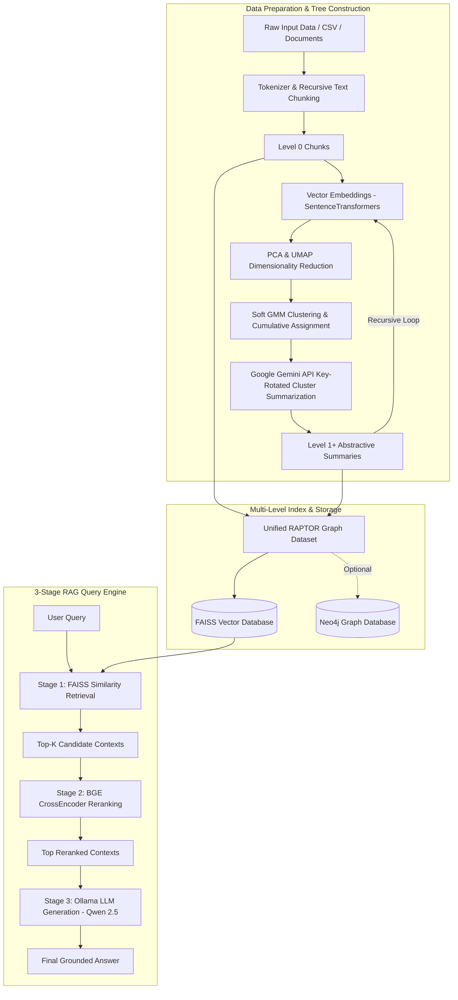
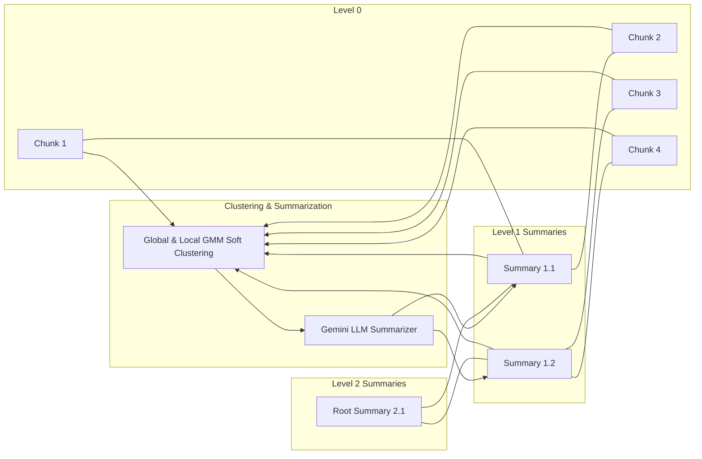
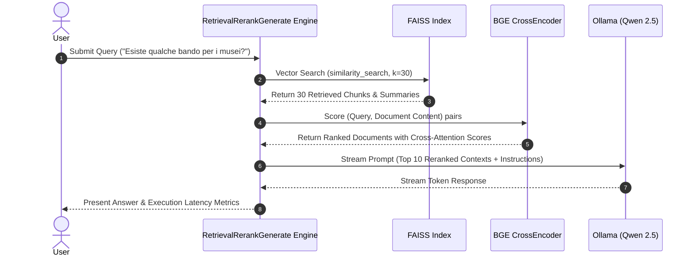

# RAPTOR: Recursive Abstractive Processing for Tree-Organized Retrieval

[](https://www.python.org/downloads/release/python-3110/)
[](LICENSE)
[](https://github.com/langchain-ai/langchain)

An end-to-end Python implementation of **RAPTOR** (Recursive Abstractive Processing for Tree-Organized Retrieval) for Hierarchical RAG (Retrieval-Augmented Generation). 

This repository constructs multi-level tree structures over text corpora by recursively combining **Soft GMM Clustering**, **UMAP Dimensionality Reduction**, **LLM Abstractive Summarization** (Google Gemini), and a **3-Stage RAG Query Engine** (FAISS Retrieval + BGE Reranking + Ollama Generation).

---

## 📐 Architecture & Pipeline Flowcharts

### 1. High-Level System Architecture



---

### 2. Multi-Level Tree Building Pipeline



> **💡 Dual-Pipeline Clustering Strategy**
> To maximize stability and precisely reflect the notebook's execution, the clustering process dynamically adapts based on the tree level:
> - **Pipeline A (Level 0 $\rightarrow$ 1):** Uses fixed PCA (90%), Global UMAP (scaled neighbors), and Local UMAP with fixed `n_neighbors=10` and `euclidean` metrics for massive chunk datasets.
> - **Pipeline B (Level 1 $\rightarrow$ N):** For upper levels with fewer nodes, it employs dynamic PCA bounds, skips Local UMAP if $N \le 3$, and switches to `min_dist=0.0` with `cosine` metrics (init='random') to prevent dimensionality reduction crashes on tiny arrays.

---

### 3. 3-Stage RAG Query Engine



---

## 📁 Repository Structure

```
RAPTOR/
├── .gitignore                    # Excludes secrets, caches, and output indexes
├── .env                          # Local environment file with API keys & hosts
├── .env.example                  # Template environment file for GitHub users
├── requirements.txt              # Python dependencies
├── README.md                     # Documentation & visual guides
├── raptor/                       # Core RAPTOR Package
│   ├── __init__.py               # Package exports
│   ├── config.py                 # Configuration manager & env loader
│   ├── chunking.py               # Tokenizer text splitter & document builder
│   ├── clustering.py             # PCA, UMAP, & GMM soft clustering
│   ├── summarization.py          # Gemini API key-rotation summarization
│   ├── tree_builder.py           # Recursive RAPTOR tree generator
│   ├── vectorstore.py            # FAISS vector store manager
│   ├── graph.py                  # Optional Neo4j graph database ingestion
│   └── query_engine.py           # 3-Stage RAG engine (Retrieval + Rerank + Ollama)
└── scripts/                      # Executable CLI Scripts
    ├── run_training_pipeline.py  # Run full tree construction on dataset
    ├── run_query.py              # Query trained FAISS index
    └── run_custom_pipeline.py    # Run RAPTOR on custom text files & models
```

---

## ⚙️ Installation & Setup

### 1. Clone & Environment Setup
```bash
git clone https://github.com/your-username/RAPTOR.git
cd RAPTOR

# Create virtual environment (Python 3.11 recommended)
python -m venv .venv
source .venv/bin/activate  # On Windows: .\.venv\Scripts\activate

# Install dependencies
pip install -r requirements.txt
```

### 2. Configure Environment Variables
Copy `.env.example` to `.env` and fill in your API keys and hosts:
```bash
cp .env.example .env
```

Edit `.env`:
```env
# Gemini API Key(s) for cluster summarization
GEMINI_API_KEY_1=your_gemini_api_key_here

# Ollama LLM Server Settings
OLLAMA_HOST=http://localhost:11434
OLLAMA_MODEL=qwen2.5:14b-instruct

# Model Specifications
EMBEDDING_MODEL=sentence-transformers/paraphrase-multilingual-mpnet-base-v2
RERANKER_MODEL=BAAI/bge-reranker-v2-m3
FAISS_INDEX_PATH=faiss_index_all_texts
```

---

## 🚀 Usage Guide

### 1. Querying an Existing Trained Index
If you already have a trained index (`faiss_index_all_texts`), you can ask questions right away:

```bash
python scripts/run_query.py --query "Esiste qualche bando per i musei?"
```

**Options:**
- `--faiss-path`: Path to FAISS index directory (default: `faiss_index_all_texts`)
- `--retrieval-k`: Number of documents for initial vector search (default: `30`)
- `--rerank-k`: Number of top documents to pass to CrossEncoder reranker (default: `10`)
- `--ollama-host`: Ollama host URL (default: from `.env`)
- `--ollama-model`: Ollama model name (default: `qwen2.5:14b-instruct`)

---

### 2. Running the Full Training Pipeline
To build a RAPTOR tree across a multi-section dataset (e.g., `bandi_neo4j.csv`):

```bash
python scripts/run_training_pipeline.py --csv-path ../bandi_neo4j.csv --max-levels 3
```

> **Note on Full Datasets**:
> In a complete production setup, the tree building pipeline is executed across all sections of your corpus (e.g., `section_budget`, `section_experts`, `section_finality`, `section_intervention`, `section_participants`). The resulting nodes are aggregated into a single unified FAISS index (`faiss_index_all_texts`).

Optional Neo4j Graph Ingestion:
```bash
python scripts/run_training_pipeline.py --csv-path ../bandi_neo4j.csv --ingest-neo4j
```

---

### 3. Running RAPTOR on Custom Texts & Models
You can run the entire tree creation pipeline on your own custom text files or custom document directories using `run_custom_pipeline.py`:

```bash
python scripts/run_custom_pipeline.py \
  --input /path/to/your/text_files/ \
  --output-index my_custom_faiss_index \
  --embedding-model sentence-transformers/paraphrase-multilingual-mpnet-base-v2 \
  --gemini-model gemini-2.5-flash \
  --max-levels 3
```

After building your custom index, query it immediately:
```bash
python scripts/run_query.py --faiss-path my_custom_faiss_index --query "Your question here"
```

---

## 🛠️ Python API Integration

You can also use RAPTOR modules directly in your Python code:

```python
from raptor.query_engine import RetrievalRerankGenerate

# Initialize the 3-stage RAG engine
rag_system = RetrievalRerankGenerate(
    faiss_path="faiss_index_all_texts",
    embedding_model="sentence-transformers/paraphrase-multilingual-mpnet-base-v2",
    reranker_model="BAAI/bge-reranker-v2-m3",
    ollama_host="http://localhost:11434",
    ollama_model="qwen2.5:14b-instruct",
    temperature=0.0
)

# Execute query
result = rag_system.process_query(
    query="Esiste qualche bando per i musei?",
    retrieval_k=30,
    rerank_k=10,
    verbose=True
)

print("Generated Answer:", result["response"])
```

---

## 📄 License
Distributed under the MIT License. See `LICENSE` for details.
